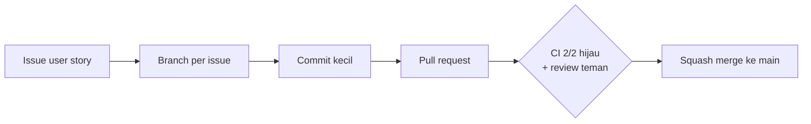

# Panduan Alur Kerja Tim

Dokumen ini menjelaskan cara tim bekerja di repo NAKESA. Setiap perubahan masuk ke `main` lewat pull request yang tertaut ke issue, jadi riwayat pengerjaan bisa dibaca urut: dari user story, ke kode, sampai review.



## 1. Issue

Semua pekerjaan dimulai dari issue. Pakai template yang tersedia saat membuat issue baru.

| Jenis | Judul | Isi |
|---|---|---|
| User story | `[US x.y] Role — Nama Fitur` | "**Sebagai** …, **saya ingin** …, **agar** …", lalu Acceptance Criteria (checklist) dan Catatan Teknis |
| Bug | `fix(scope): ringkasan masalah` | Langkah reproduksi, yang terjadi, dan yang seharusnya |
| Lainnya | Format Conventional Commits, misalnya `docs: …`, `test: …` | Latar belakang dan Acceptance Criteria |

Angka `x` pada user story adalah modul (epic), sesuai menu aplikasi:

| x | Modul |
|---|---|
| 1 | Akun & onboarding |
| 2 | Beranda & dashboard |
| 3 | Booking |
| 4 | Pasien |
| 5 | Obat |
| 6 | Keuangan |
| 7 | Praktik |

**Label:** `feature`, `bug`, `docs`, `refactor`, `ui`, `enhancement`, `accessibility`, `priority:high`.
**Milestone:** `MVP`, lalu `Rilis 1`.

> Fitur yang dibuat sebelum alur ini dipakai sudah dicatat ulang sebagai user story yang ditutup, lengkap dengan commit buktinya.

## 2. Branch

Satu branch untuk satu issue, dibuat dari `main` terbaru dengan format `<tipe>/<nomor-issue>-<deskripsi-singkat>`:

```bash
git switch main && git pull
git switch -c fix/17-jam-booking
# atau langsung dari issue:
gh issue develop 17 --checkout
```

Jangan push langsung ke `main`.

## 3. Commit (Conventional Commits)

Format: `tipe(scope): deskripsi singkat`. Pakai kata kerja perintah, huruf kecil, Bahasa Indonesia. Satu commit untuk satu perubahan logis.

| Tipe | Dipakai untuk | Contoh |
|---|---|---|
| `feat` | Fitur baru | `feat(obat): tambah ekspor daftar stok` |
| `fix` | Perbaikan bug | `fix(booking): batasi jam sesuai jam praktik` |
| `refactor` | Merapikan kode tanpa mengubah perilaku | `refactor(shell): pisahkan navigasi bawah` |
| `style` | Tampilan/format tanpa mengubah logika | `style(keuangan): ubah css manual ke tailwind` |
| `docs` | Dokumentasi | `docs: lengkapi README` |
| `test` | Menambah atau memperbaiki test | `test(format): uji format rupiah` |
| `chore` | Konfigurasi, dependensi, CI | `chore(ci): tambah job test` |

## 4. Pull request

1. Push branch: `git push -u origin HEAD`.
2. Buka PR ke `main`: `gh pr create --base main`. Judul PR memakai format Conventional Commits; untuk user story sebutkan kodenya, misalnya `feat(obat): tambah ekspor daftar stok [US 5.2]`.
3. Isi template PR: ringkasan, `Closes #<nomor issue>`, jenis perubahan, cara mengetes, dan screenshot bila tampilan berubah.

Sebelum push, jalankan pengecekan yang sama dengan CI:

```bash
find js -name '*.js' -print0 | xargs -0 -n1 node --check   # sintaks JavaScript
node .github/scripts/check-refs.mjs                         # src/href dan import menunjuk ke file yang ada
```

## 5. CI (GitHub Actions)

Setiap PR ke `main` menjalankan 2 job. Keduanya harus hijau (✓ 2/2) sebelum merge.

| Job | Yang dicek |
|---|---|
| `js-syntax` | `node --check` untuk semua file di `js/` |
| `check-refs` | Setiap `src`/`href` lokal di HTML dan setiap import relatif di JS menunjuk ke file yang ada |

Detailnya ada di `.github/workflows/ci.yml`.

## 6. Review dan merge

| Situasi | Aturan |
|---|---|
| Fitur baru atau perubahan logika | Wajib di-review teman sebelum merge |
| Typo, style kecil, dokumentasi | Boleh merge sendiri setelah CI hijau (tetap lewat PR) |
| Teman tidak aktif lebih dari 24 jam | Boleh merge sendiri, lalu minta review menyusul lewat komentar |

Merge dengan **Squash and merge** supaya satu PR menjadi satu commit rapi di `main`, lalu hapus branch-nya. Issue yang disebut dengan `Closes #` otomatis tertutup.

## 7. Keamanan data pasien

- Hanya *publishable key* Supabase yang boleh ada di `js/config.js`, jangan pernah *service-role/secret key*.
- `.env` dan file rahasia lain tidak boleh di-commit (sudah ada di `.gitignore`).
- Setiap tabel baru wajib memakai Row Level Security berbasis `owner_id = auth.uid()`, dan perubahan skema ditulis sebagai migrasi baru di `supabase/migrations/`.
- Data dari pengguna yang dimasukkan ke `innerHTML` wajib lewat `escapeHtml()` (`js/format.js`).
