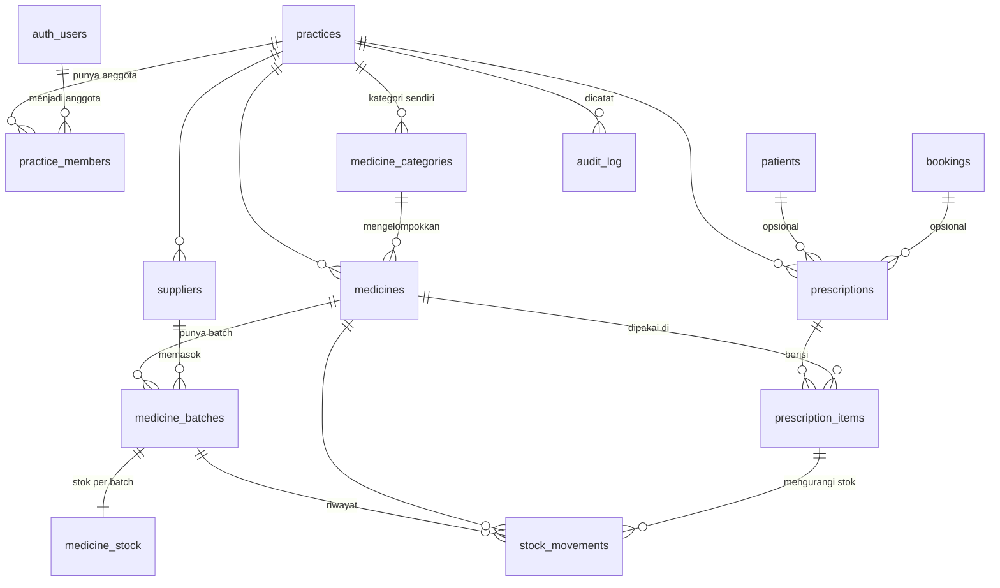
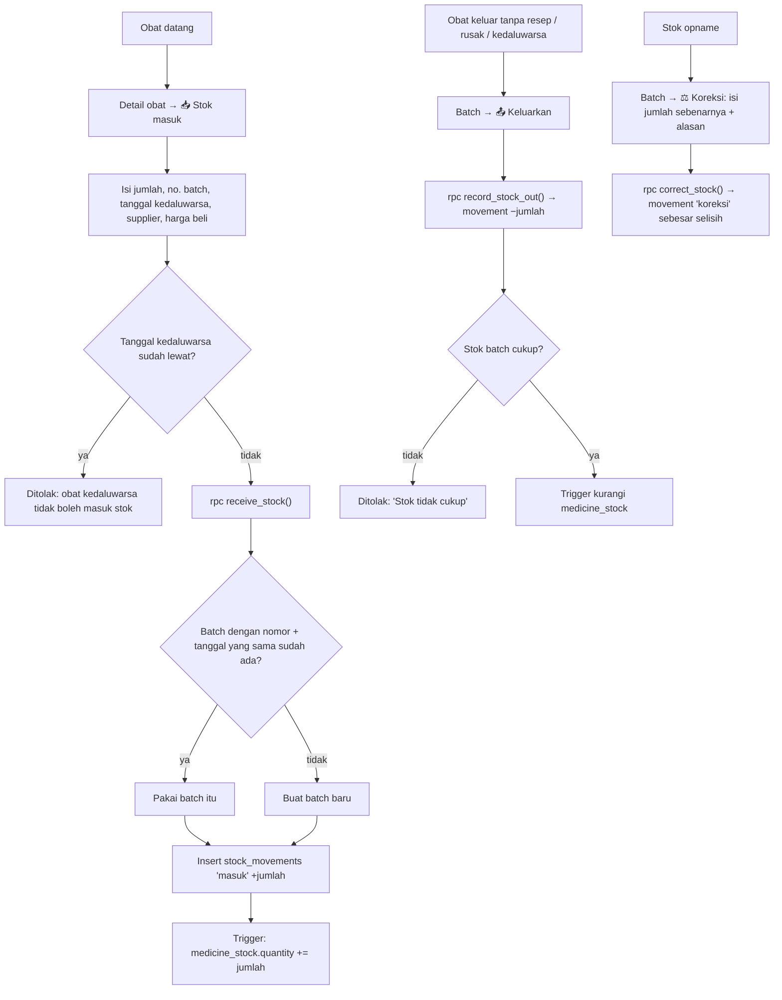
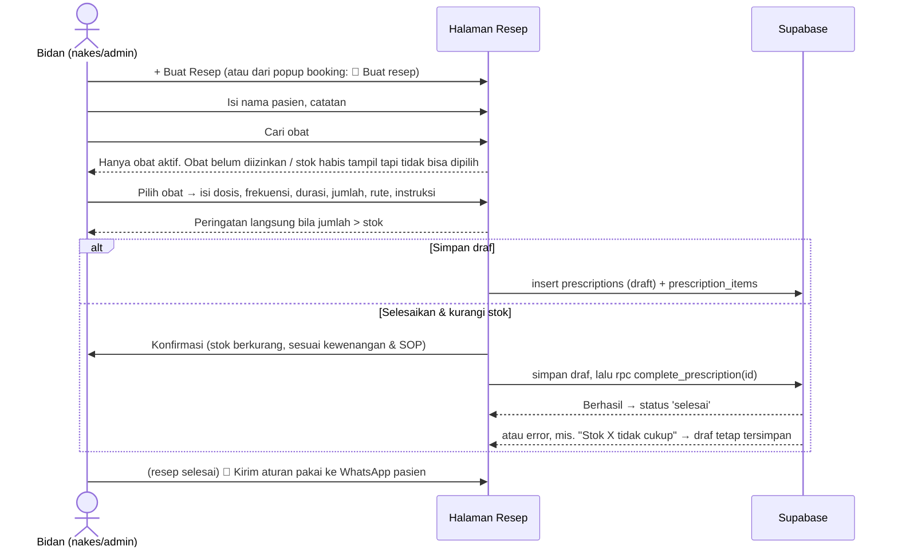

# Sistem Database Obat & Resep — NAKESA

Rancangan dan implementasi modul obat untuk praktik mandiri tenaga kesehatan (fokus awal: bidan).
Semua bagian di bawah sudah dibangun di repo ini; dokumen ini menjelaskan rancangannya.

| Bagian | File |
|---|---|
| Skema database (migrasi) | [`supabase/migrations/20261005151705_medicine_inventory.sql`](../supabase/migrations/20261005151705_medicine_inventory.sql) |
| Halaman Database Obat (`/obat`) | `html/medicines.html`, `js/pages/medicines.js` |
| Halaman Detail Obat (`/obat/[id]`) | `html/medicine.html?id=…`, `js/pages/medicine.js` |
| Halaman Resep (`/resep`) | `html/prescriptions.html`, `js/pages/prescriptions.js` |
| Form bersama (tambah/edit obat, stok masuk) | `js/medicine-forms.js` |
| Status, golongan, jenis transaksi | `js/practice-utils.js` |
| Role pengguna | `js/roles.js` |

> **Catatan penting tentang data medis.** Sistem ini tidak menentukan obat apa yang boleh diberikan.
> Indikasi, kontraindikasi, aturan pakai, dan kewenangan pemberian obat **perlu divalidasi berdasarkan
> regulasi/SOP/tenaga kesehatan** (lihat bagian 16). Sistem hanya memastikan obat yang dipakai di resep
> sudah *ditinjau dan diizinkan* oleh admin praktik.

---

## 1. Struktur database (ERD)



Prinsip utamanya:

- **Stok tidak pernah diketik langsung.** Setiap perubahan stok adalah satu baris `stock_movements`.
  Tabel `medicine_stock` (jumlah per batch) diperbarui otomatis oleh trigger.
- **Stok dihitung per batch**, karena setiap batch punya tanggal kedaluwarsa sendiri.
- **Satu akun = satu praktik**, tetapi akses dicek lewat `practice_members` (role), sehingga nanti bisa
  menambah bidan/staf lain tanpa mengubah tabel.

## 2. Skema SQL (PostgreSQL / Supabase)

SQL lengkap ada di file migrasi di atas. Ringkasan tabelnya:

| Tabel | Kolom penting | Keterangan |
|---|---|---|
| `practice_members` | `practice_id`, `user_id`, `role` (`admin`/`nakes`/`staf`) | Role pengguna di praktik. Pemilik otomatis `admin`. |
| `medicine_categories` | `id`, `practice_id` (null = kategori bawaan), `name`, `sort_order` | 13 kategori bawaan + kategori buatan praktik. |
| `suppliers` | `id`, `practice_id`, `name`, `phone`, `address`, `notes`, `is_active` | |
| `medicines` | `id` (ID obat), `generic_name`, `brand_name`, `category_id`, `dosage_form` (bentuk sediaan), `strength` (kekuatan/dosis), `unit`, `route`, `indications`, `contraindications`, `usage_instructions` (aturan pakai), `min_stock`, `buy_price`, `sell_price`, `drug_class` (golongan), `use_in_service` (diizinkan dipakai di layanan), `is_active`, `notes` | Data master obat. Tabel lama `medicines` diperluas; stok lama dipindah ke batch. |
| `medicine_batches` | `id`, `medicine_id`, `batch_number`, `expires_on`, `supplier_id`, `buy_price`, `received_on` | Unik per (obat, nomor batch, tanggal kedaluwarsa). |
| `medicine_stock` | `batch_id` (PK), `medicine_id`, `quantity ≥ 0` | Hanya ditulis oleh trigger. |
| `stock_movements` | `batch_id`, `medicine_id`, `movement_type`, `quantity` (±), `stock_after`, `note`, `prescription_item_id`, `created_by`, `created_at` | Riwayat semua perubahan stok. Tidak bisa diubah/dihapus. |
| `prescriptions` | `id`, `patient_id`, `patient_name`, `booking_id`, `status` (`draft`/`selesai`/`batal`), `notes`, `prescribed_by`, `completed_at` | |
| `prescription_items` | `prescription_id`, `medicine_id`, `dose`, `frequency`, `duration`, `quantity`, `route`, `instructions` | |
| `audit_log` | `table_name`, `record_id`, `action`, `changed_by`, `changed_at`, `old_data`, `new_data` | Diisi trigger untuk perubahan penting. |
| `practices.expiry_warning_days` | angka hari (default 90) | Batas "akan kedaluwarsa", bisa diubah admin. |

View **`medicine_inventory`** (dengan `security_invoker`, jadi tetap mengikuti RLS) menggabungkan obat,
kategori, dan stok: `stock` (yang belum kedaluwarsa), `expired_stock`, `batch_count`, `nearest_expiry`,
`stock_status` (`aman`/`menipis`/`habis`), dan `expiry_status` (`aman`/`akan_kedaluwarsa`/`kedaluwarsa`).

Aturan yang dijaga di database (bukan hanya di tampilan):

- `CHECK` panjang teks, harga ≥ 0, jumlah ≠ 0, stok ≥ 0.
- Tanda jumlah sesuai jenis: `masuk` > 0; `keluar`, `resep`, `kedaluwarsa`, `rusak` < 0; `koreksi` bebas.
- Movement `resep` wajib punya `prescription_item_id`, dan hanya bisa dibuat oleh `complete_prescription()`.
- Foreign key gabungan `(…_id, practice_id)` memastikan batch, item resep, dan obat selalu dari praktik yang sama.

## 3. Relasi antar tabel & foreign key

| Dari | Ke | Saat induk dihapus | Alasan |
|---|---|---|---|
| `practice_members.practice_id` | `practices.id` | cascade | Anggota hilang bersama praktik. |
| `practice_members.user_id` | `auth.users.id` | cascade | |
| `medicine_categories.practice_id` | `practices.id` | cascade | `null` = kategori bawaan. |
| `medicines.practice_id` | `practices.id` | cascade | |
| `medicines.category_id` | `medicine_categories.id` | ditolak | Kategori yang dipakai tidak bisa dihapus. |
| `medicine_batches(medicine_id, practice_id)` | `medicines(id, practice_id)` | **ditolak** | Obat yang punya riwayat stok tidak bisa dihapus, hanya dinonaktifkan. |
| `medicine_batches(supplier_id, practice_id)` | `suppliers(id, practice_id)` | ditolak | Supplier dinonaktifkan, bukan dihapus. |
| `medicine_stock.batch_id` | `medicine_batches.id` | cascade | Stok adalah turunan batch. |
| `stock_movements.batch_id` / `medicine_id` | batch / obat | **ditolak** | Riwayat harus tetap ada. |
| `stock_movements.prescription_item_id` | `prescription_items.id` | ditolak | Item resep selesai tidak bisa dihapus. |
| `prescriptions.patient_id` | `patients.id` | set null | Resep tetap ada walau data pasien dihapus (nama tersimpan di `patient_name`). |
| `prescriptions.booking_id` | `bookings.id` | set null | |
| `prescription_items(prescription_id, practice_id)` | `prescriptions(id, practice_id)` | cascade | Item ikut terhapus bila draf dihapus. |
| `prescription_items(medicine_id, practice_id)` | `medicines(id, practice_id)` | ditolak | |

Foreign key yang "ditolak" dibuat `deferrable initially deferred`, sehingga penghapusan seluruh praktik
(yang menyebar lewat beberapa jalur cascade sekaligus) tetap berhasil, sedangkan penghapusan satu obat
yang punya riwayat tetap ditolak.

## 4. Contoh seed data obat

**Kategori bawaan** (dibuat oleh migrasi): Kehamilan, Persalinan, Nifas, Menyusui, Kontrasepsi,
Bayi Baru Lahir, Vitamin & Mineral, Analgesik/Antipiretik, Antibiotik, Obat Simptomatik,
Obat Kegawatdaruratan, Cairan/Infus, Obat Lainnya.

**Contoh obat** ditambahkan lewat tombol *"Isi contoh obat kebidanan"* (fungsi `add_example_medicines()`),
bukan otomatis, supaya data asli praktik tidak tercampur. Semua contoh:

- stok **0** (stok asli dicatat lewat *Stok masuk*),
- **belum diizinkan** dipakai di resep (`use_in_service = false`),
- indikasi, kontraindikasi, dan aturan pakai **dikosongkan**, dengan catatan *"perlu divalidasi berdasarkan regulasi/SOP/tenaga kesehatan"*.

| Nama generik | Kategori | Bentuk | Kekuatan | Golongan |
|---|---|---|---|---|
| Paracetamol | Analgesik/Antipiretik | Tablet | 500 mg | Obat bebas |
| Tablet tambah darah (Fe + asam folat) | Kehamilan | Tablet salut | *perlu diisi sesuai produk* | *perlu divalidasi* |
| Asam folat | Kehamilan | Tablet | *perlu diisi* | *perlu divalidasi* |
| Kalsium laktat | Kehamilan | Tablet | *perlu diisi* | *perlu divalidasi* |
| Vitamin A (kapsul merah) | Nifas | Kapsul lunak | 200.000 IU | *perlu divalidasi* |
| Oralit | Obat Simptomatik | Serbuk (sachet) | untuk 200 mL larutan | Obat bebas |
| Antasida (Al(OH)₃ + Mg(OH)₂) | Obat Simptomatik | Tablet kunyah | *perlu diisi* | *perlu divalidasi* |
| Amoxicillin | Antibiotik | Kapsul | 500 mg | Obat keras |
| Ampicillin | Antibiotik | Serbuk injeksi (vial) | 1 g | Obat keras |
| Metronidazole | Antibiotik | Tablet | 500 mg | Obat keras |
| Oxytocin | Persalinan | Injeksi (ampul) | 10 IU/mL | Obat keras |
| Lidokain | Persalinan | Injeksi (ampul) | 2% | Obat keras |
| Magnesium sulfat | Obat Kegawatdaruratan | Injeksi (vial) | 40% | Obat keras |
| Vitamin K1 (fitomenadion) | Bayi Baru Lahir | Injeksi (ampul) | *perlu diisi* | Obat keras |
| Salep mata antibiotik | Bayi Baru Lahir | Salep mata | *perlu diisi* | Obat keras |
| Pil KB kombinasi | Kontrasepsi | Tablet | *perlu diisi* | Obat keras |
| Suntik KB 3 bulan (DMPA) | Kontrasepsi | Injeksi suspensi | 150 mg/mL | Obat keras |
| Suntik KB 1 bulan | Kontrasepsi | Injeksi | *perlu diisi* | Obat keras |
| Kondom | Kontrasepsi | Alat | — | Alat kesehatan |
| Ringer laktat | Cairan/Infus | Cairan infus | 500 mL | Obat keras |
| NaCl 0,9% | Cairan/Infus | Cairan infus | 500 mL | Obat keras |
| Vitamin B kompleks | Vitamin & Mineral | Tablet | *perlu diisi* | *perlu divalidasi* |

Kekuatan dan golongan yang ditulis adalah sediaan yang umum beredar. Tetap **sesuaikan dengan produk yang
benar-benar ada di praktik**, karena merek dan kemasan bisa berbeda.

## 5. Struktur API / service

Aplikasi tidak punya server sendiri. Frontend memanggil Supabase langsung (REST otomatis + fungsi database).
Semua panggilan berjalan sebagai pengguna yang login, jadi **RLS selalu berlaku**.

**Baca data (REST):**

| Kebutuhan | Panggilan |
|---|---|
| Daftar obat + stok + status | `from('medicine_inventory').select('*')` |
| Detail obat | `from('medicines').select('*, medicine_categories(name)').eq('id', id)` |
| Batch + stok + supplier | `from('medicine_batches').select('…, suppliers(name), medicine_stock(quantity)')` |
| Riwayat stok | `from('stock_movements').select('…, medicine_batches(batch_number)').eq('medicine_id', id)` |
| Penggunaan di resep | `from('prescription_items').select('…, prescriptions(patient_name, status)')` |
| Daftar resep | `from('prescriptions').select('…, prescription_items(…, medicines(generic_name, unit))')` |

**Ubah data:**

| Aksi | Panggilan | Siapa |
|---|---|---|
| Tambah / edit obat | `insert` / `update` ke `medicines` | admin, nakes |
| Izinkan obat dipakai di layanan | `update medicines set use_in_service` (dicek trigger) | **admin saja** |
| Nonaktifkan / aktifkan | `update medicines set is_active` | admin, nakes |
| Hapus obat (yang belum pernah dipakai) | `delete from medicines` | admin |
| Stok masuk | `rpc('receive_stock', { p_medicine_id, p_quantity, p_expires_on, p_batch_number, p_supplier_id, p_buy_price, p_note })` | admin, nakes |
| Stok keluar / rusak / kedaluwarsa | `rpc('record_stock_out', { p_batch_id, p_type, p_quantity, p_note })` | admin, nakes |
| Koreksi (stok opname) | `rpc('correct_stock', { p_batch_id, p_counted, p_note })` | admin, nakes |
| Simpan draf resep | `insert` ke `prescriptions` + `prescription_items` | admin, nakes |
| Selesaikan resep (stok berkurang) | `rpc('complete_prescription', { p_prescription_id })` | admin, nakes |
| Isi contoh obat | `rpc('add_example_medicines')` | admin, nakes |
| Atur hari peringatan kedaluwarsa | `update practices set expiry_warning_days` | admin (pemilik) |

Pesan error dari fungsi database berbahasa Indonesia dan langsung ditampilkan ke pengguna
(misalnya *"Stok Amoxicillin tidak cukup: kurang 5 kapsul."*).

## 6. Struktur folder frontend

Proyek memakai HTML + JavaScript tanpa framework dan tanpa build step, jadi "route" dipetakan ke file:

| Route di spesifikasi | File di NAKESA |
|---|---|
| `/obat` | `html/medicines.html` |
| `/obat/[id]` | `html/medicine.html?id=<id>` |
| `/resep` | `html/prescriptions.html` |

```
html/
  medicines.html          Database Obat (daftar, filter, peringatan)
  medicine.html           Detail obat (batch, riwayat, penggunaan)
  prescriptions.html      Resep (daftar + form buat resep)
js/
  medicine-forms.js       Dialog bersama: tambah/edit obat, stok masuk
  practice-utils.js       Status stok/kedaluwarsa, golongan, jenis transaksi
  roles.js                Role pengguna (admin / nakes / staf)
  shell.js                Menu (termasuk "Resep" dan badge "Obat"), pesan error
  tailwind-setup.js       Komponen tampilan: data-table, alert-tile, picker, dll.
  pages/
    medicines.js
    medicine.js
    prescriptions.js
    dashboard.js          Kartu "Obat perlu dicek" membaca medicine_inventory
supabase/migrations/
  20261005151705_medicine_inventory.sql
```

## 7. Desain halaman Database Obat

```
┌──────────────────────────────────────────────────────────────────────┐
│ 💊 Database Obat                               [📝 Resep] [+ Tambah Obat] │
│ Stok, batch, dan tanggal kedaluwarsa semua obat praktik.              │
├──────────────────┬──────────────────────┬────────────────────────────┤
│ 🔴 1 obat ada yang│ 🟡 2 obat akan        │ 📉 3 obat stoknya          │  ← kartu peringatan,
│   sudah kedaluwarsa│   kedaluwarsa (≤90 hr)│   menipis / habis          │    bisa diklik sbg filter
├──────────────────┴──────────────────────┴────────────────────────────┤
│ [🔍 Cari nama generik / dagang] [Kategori ▾] [Status stok ▾] [Kedaluwarsa ▾] │
│ 8 obat                       [☐ Tampilkan nonaktif] [⚙️ Peringatan kedaluwarsa] │
├──────────────┬──────────┬───────────────┬──────┬───────────────┬──────┬───────────────┤
│ OBAT         │ KATEGORI │          STOK │BATCH │ KEDALUWARSA   │STATUS│          AKSI │
│ Paracetamol  │ Analgesik│ 155 tablet    │3     │ 25 Okt 2026   │Aktif │Detail Edit    │
│ Sanmol·500 mg│          │ [Stok aman]   │batch │ 🔴 Ada stok   │      │Nonaktifkan    │
│ [Obat bebas] │          │ +10 kedaluwarsa│     │   kedaluwarsa │      │               │
└──────────────┴──────────┴───────────────┴──────┴───────────────┴──────┴───────────────┘
```

- Di HP, setiap baris tabel berubah menjadi kartu dengan label kolom (tidak perlu geser ke samping).
- Badge **"Perlu ditinjau"** muncul pada obat yang belum diizinkan admin untuk dipakai di resep.
- Database kosong menampilkan tombol *Tambah Obat* dan *Isi contoh obat kebidanan*.

**Detail obat** (`medicine.html?id=…`): judul + badge (aktif, golongan, izin layanan), tombol
*Stok masuk / Edit / Nonaktifkan / Hapus*, 4 angka (stok bisa dipakai, batch berisi stok, kedaluwarsa
terdekat, terpakai 30 hari), kartu *Data obat* dan *Informasi klinis*, tabel **Batch & stok** (dengan
tombol *Keluarkan* dan *Koreksi* per batch), tabel **Riwayat transaksi stok**, dan tabel
**Penggunaan di resep**.

## 8. Flow stok masuk / keluar



Riwayat tidak pernah diubah. Kesalahan input diperbaiki dengan baris **koreksi** baru, sehingga
setiap angka stok bisa ditelusuri asal-usulnya.

## 9. Flow pembuatan resep



## 10. Flow pengurangan stok otomatis

`complete_prescription(id)` berjalan dalam **satu transaksi**:

1. Kunci resep, cek pengguna adalah admin/nakes di praktik itu, cek status masih `draft`, dan ada minimal satu obat.
2. Untuk setiap item:
   - obat harus **aktif** dan **diizinkan dipakai di layanan**;
   - ambil batch yang stoknya > 0 dan **belum kedaluwarsa**, urut **tanggal kedaluwarsa terdekat dulu (FEFO)**, dan kunci barisnya (`FOR UPDATE`);
   - buat movement `resep` (negatif) per batch yang dipakai, terhubung ke `prescription_item_id`;
   - bila stok total kurang, muncul error dan **seluruh transaksi dibatalkan** (tidak ada stok yang berkurang).
3. Ubah status resep menjadi `selesai` dan isi `completed_at`.

Trigger `apply_stock_movement` pada setiap movement mengunci baris stok batch, menolak stok minus,
memperbarui `medicine_stock`, dan menyimpan `stock_after` untuk riwayat.

## 11. Notifikasi stok minimum

- Setiap obat punya `min_stock`. View menghitung `stock_status`: `habis` (0), `menipis` (≤ min), `aman`.
- Stok yang dihitung hanya stok **yang belum kedaluwarsa**.
- Ditampilkan di:
  - **Badge angka di menu "Obat"** (semua halaman): jumlah obat aktif yang stoknya menipis/habis atau bermasalah kedaluwarsa;
  - **Kartu peringatan** di Database Obat (bisa diklik untuk menyaring);
  - **Beranda**: kartu "Obat perlu dicek" dan chip di bagian atas, dengan popup daftar obatnya.
- *Tahap berikutnya (opsional):* ringkasan harian lewat WhatsApp/email memakai `pg_cron` + Edge Function.

## 12. Notifikasi obat kedaluwarsa

| Indikator | Arti |
|---|---|
| 🟢 Aman | Tanggal kedaluwarsa masih lebih dari *N* hari lagi |
| 🟡 Akan kedaluwarsa | Kedaluwarsa dalam *N* hari ke depan |
| 🔴 Kedaluwarsa | Sudah lewat. Di level obat ditampilkan sebagai "Ada stok kedaluwarsa" |

- *N* diatur admin di **⚙️ Peringatan kedaluwarsa** (`practices.expiry_warning_days`, default 90 hari, 1–365).
- Batch kedaluwarsa **tidak dihitung** sebagai stok yang bisa dipakai, **tidak dipakai** saat resep diselesaikan,
  dan tombolnya berubah menjadi **"⌛ Keluarkan (kedaluwarsa)"** supaya segera dicatat keluar.

## 13. Role & permission

| Aksi | Admin (pemilik) | Nakes (bidan) | Staf | Pasien / publik |
|---|:-:|:-:|:-:|:-:|
| Lihat obat, stok, batch, riwayat stok | ✅ | ✅ | ✅ | ❌ |
| Tambah / edit / nonaktifkan obat | ✅ | ✅ | ❌ | ❌ |
| Izinkan obat dipakai di layanan | ✅ | ❌ | ❌ | ❌ |
| Hapus obat (yang belum pernah dipakai) | ✅ | ❌ | ❌ | ❌ |
| Stok masuk / keluar / koreksi | ✅ | ✅ | ❌ | ❌ |
| Lihat & buat resep, selesaikan resep | ✅ | ✅ | ❌ | ❌ |
| Lihat audit log | ✅ | ❌ | ❌ | ❌ |
| Ubah pengaturan peringatan kedaluwarsa | ✅ | ❌ | ❌ | ❌ |

Keamanan yang diterapkan:

- **Autentikasi** lewat Supabase Auth (email + kata sandi / Google). Kata sandi tidak pernah disimpan di tabel aplikasi.
- **RLS aktif di semua tabel.** Fungsi bantu `private.my_practices()`, `my_clinical_practices()`, `my_admin_practices()`
  ada di skema `private` (tidak terekspos API) dan hanya membaca keanggotaan pengguna yang sedang login.
- **Hak kolom** dibatasi dengan `GRANT` per kolom (misalnya `created_by`, `stock_after`, `prescribed_by` tidak bisa diisi dari luar).
- `anon` (pengguna yang belum login) **tidak punya akses** sama sekali ke tabel obat dan resep.
- **Audit log** mencatat perubahan pada obat, batch, supplier, resep, dan anggota praktik (data lama dan baru dalam JSON).
- Fungsi `SECURITY DEFINER` hanya dipakai bila perlu (`complete_prescription`, trigger), dengan `search_path = ''` dan pengecekan role di awal.

> **Batasan MVP.** Saat ini hanya pemilik praktik yang bisa login ke praktiknya (sebagai admin). Tabel dan aturan
> role sudah siap untuk anggota lain, tetapi fitur **undang bidan/staf** belum ada, dan tabel lama (pasien, booking,
> keuangan) masih khusus pemilik. Keduanya masuk tahap berikutnya (bagian 15).

## 14. Contoh UI

Tampilan mengikuti gaya NAKESA yang sudah ada (Notion + Claude, mode terang/gelap, ramah HP):

- **Kartu peringatan berwarna** (merah/kuning/oranye) yang sekaligus menjadi filter.
- **Tabel data** dengan header tipis, angka rata kanan, badge status berwarna; di HP otomatis menjadi kartu.
- **Badge golongan obat** (Obat bebas hijau, Obat keras merah, Alat kesehatan abu-abu) dan **"Perlu ditinjau"**.
- **Form obat dua kolom** dengan bagian *Informasi klinis* yang diberi kotak peringatan "perlu divalidasi".
- **Pemilih obat di resep**: hasil pencarian menampilkan stok dan status. Obat yang tidak bisa dipakai
  tampil redup dengan alasannya ("Belum diizinkan admin", "Stok habis").
- **Peringatan langsung** saat jumlah resep melebihi stok, dan **dialog konfirmasi** sebelum stok dikurangi.

## 15. Langkah implementasi

**Sudah dikerjakan (MVP):**

1. **Database**: migrasi `medicine_inventory` (role, kategori, supplier, obat, batch, stok, movement, resep, audit log, view, fungsi).
2. **Uji database**: 45 skenario diuji di Postgres 17 (PGlite), antara lain RLS per role, isolasi antar praktik,
   anon ditolak, stok tidak bisa minus, riwayat tidak bisa diubah, FEFO, resep gagal tidak mengurangi stok,
   izin hanya oleh admin, audit log, dan penghapusan praktik.
3. **Frontend**: Database Obat, Detail Obat, Resep, form bersama, badge menu, integrasi Beranda dan booking.
4. **Terapkan migrasi** ke project Supabase, lalu jalankan *Security/Performance Advisors*.

**Tahap berikutnya:**

1. **Undang anggota praktik** (bidan/staf) lewat email, dan ubah RLS pasien/booking/keuangan ke model `practice_members`.
2. **Notifikasi terjadwal** (WhatsApp/email harian) untuk stok minimum dan kedaluwarsa (`pg_cron` + Edge Function).
3. **Pembatalan resep selesai** dengan pengembalian stok otomatis (movement balik yang terhubung ke resep).
4. **Cetak resep / etiket obat** dan laporan stok opname bulanan.
5. Kategori dan contoh obat bawaan yang menyesuaikan profesi (dokter, perawat, dll.), tidak hanya kebidanan.

## 16. Bagian yang perlu divalidasi

Bagian berikut **perlu divalidasi berdasarkan regulasi/SOP/tenaga kesehatan** dan tidak boleh dianggap benar begitu saja:

- **Kewenangan pemberian obat oleh bidan** dan tenaga kesehatan lain: ikuti peraturan yang berlaku (UU Kesehatan
  dan peraturan turunannya, termasuk peraturan tentang izin dan penyelenggaraan praktik bidan) **versi terbaru**,
  serta SOP fasilitas. Sistem hanya menyediakan *izin per obat* oleh admin, bukan aturan kewenangannya.
- **Indikasi, kontraindikasi, aturan pakai, dan dosis** setiap obat: isi dari brosur resmi, formularium, atau pedoman klinis.
- **Golongan obat** pada contoh data yang ditandai *perlu divalidasi* (suplemen/vitamin bisa berbeda per produk dan izin edarnya).
- **Kekuatan sediaan** pada contoh data: sesuaikan dengan produk yang benar-benar dipakai.
- **Batas peringatan kedaluwarsa** (default 90 hari) dan **stok minimum**: sesuaikan dengan SOP pengelolaan obat di fasilitas.
